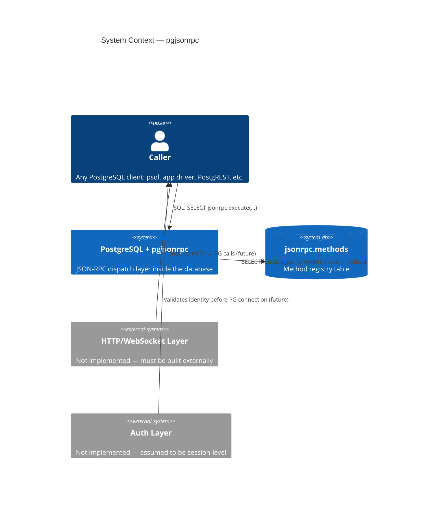
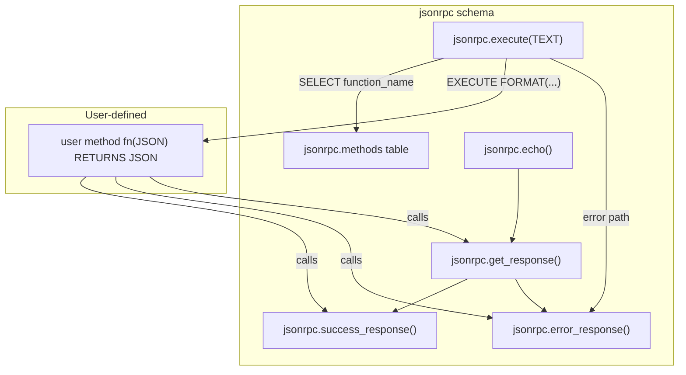

# Architecture Review

> Production-readiness and architectural audit of pgjsonrpc as the foundation for a platform (Xbase).  
> Perspective: principal PostgreSQL infrastructure engineer.

---

## 1. System Context

pgjsonrpc is a **pure-SQL PostgreSQL extension** that exposes a JSON-RPC 2.0 dispatch layer inside the database engine. It is not an HTTP server, not a connection proxy, and not an application framework. Its role is narrow: parse a JSON-RPC request, resolve a registered method, call the mapped function, and return a JSON-RPC response — all within the caller's PostgreSQL session and transaction.

---

## 2. Component Map

### Component Responsibilities

| Component | Responsibility | Quality |
|---|---|---|
| `jsonrpc.execute` | Parse, route, dispatch, handle errors | Functional; has structural issues |
| `jsonrpc.methods` | Method-to-function registry | Correct; no versioning |
| `success_response` | Build `{"result":…}` envelope | Correct; id type bug |
| `error_response` | Build `{"error":…}` envelope | Correct; id type bug |
| `get_response` | Switch between success/error | Dead parameters; redundant |
| `jsonrpc.echo` | Reference method implementation | Correct |

---

## 3. Execution Model

The system is **synchronous, single-threaded per call, and stateless**. There is no background processing, no queuing, no async execution. Each call to `jsonrpc.execute` runs entirely within the caller's session and transaction.

**Key invariants:**
- Caller's transaction context is inherited — method functions can read/write within the same transaction
- PL/pgSQL EXCEPTION blocks create implicit savepoints (PostgreSQL internals), so caught exceptions do not abort the outer transaction
- No session-level state is set or read — compatible with all connection pooler modes
- Method functions execute with the caller's privileges (SECURITY INVOKER by default)

**What this means for Xbase:**
- Atomicity of a batch request is a PostgreSQL transaction, not a JSON-RPC semantic — all items in a batch commit or rollback together
- Auth must happen at the connection level (PostgreSQL role) or be threaded through session variables (`SET LOCAL`)
- No per-request isolation possible without explicit SAVEPOINT management

---

## 4. Contract Analysis

| Contract | Current State | Classification |
|---|---|---|
| `execute(TEXT) RETURNS JSON` entry signature | Defined; stable | **Stable** |
| Method function signature `fn(JSON) RETURNS JSON` | Enforced by convention, not by PG | **Implicit** |
| `id` field type preservation | Coerces all IDs to TEXT (spec violation) | **Dangerous** |
| Batch items share caller's transaction | Undocumented; differs from spec | **Unstable** |
| Notification support (requests without `id`) | Returns `-32600` instead of silence | **Broken** |
| `jsonrpc` version field validation | Echoed back, never validated | **Underspecified** |
| Auth contract | Described in `doc/auth.md`, not implemented | **Missing** |
| Method registry schema | `methods(id, name, description, function_name)` | **Unstable** (no version column) |
| Error data leakage | Error responses include internal context | **Dangerous** |

**Contracts that MUST be frozen before any refactor:**
1. `execute(TEXT) RETURNS JSON` signature
2. Method function signature `fn(JSON) RETURNS JSON`
3. Error codes (`-32700`, `-32600`, `-32601`, `-32099`)
4. `jsonrpc.methods(name, function_name)` minimum columns

---

## 5. Architectural Boundary Analysis

### What BELONGS inside PostgreSQL

| Responsibility | Reason |
|---|---|
| RPC dispatch | Tight coupling to transaction semantics and PG permissions |
| Method registry | Schema metadata belongs with the database |
| Response envelope construction | Trivial transformation; no reason to externalize |
| Permission model | SECURITY INVOKER correctly uses caller's grants/RLS |
| Transaction semantics | Atomicity guarantees are a PG strength |

### What MUST MOVE outside PostgreSQL

| Responsibility | Reason |
|---|---|
| HTTP/WebSocket handling | PG is not a web server; use PostgREST, a custom proxy, or pgWire adapters |
| JWT/session auth validation | Cryptographic validation is expensive in SQL; belongs in the proxy |
| Rate limiting | No per-caller throttle mechanism in PG dispatch |
| Request size enforcement | No guard on `p_request TEXT` size; must be enforced at the connection layer |
| Observability/metrics | Structured request logs, timing, error rates belong in the proxy |
| SDK/client generation | Introspect `jsonrpc.methods` + `pg_proc` externally to generate typed clients |
| Connection pooling | PgBouncer or Odyssey in front of PG |
| Caching of method registry | If registry is large or frequently queried, cache at proxy layer |

---

## 6. Architectural Risks

### Risk 1 — Single Transaction for Batch (HIGH)

All batch items execute in the same transaction. If item 3 of 5 causes a database error that propagates past the exception handlers, all 5 items may fail. The JSON-RPC 2.0 spec treats batch items as independent. This is a silent semantic divergence.

**Mitigation:** Document this explicitly; consider SAVEPOINT-per-item for isolation if needed.

### Risk 2 — No HTTP Boundary (HIGH for Xbase)

Callers must speak PostgreSQL protocol. For a platform like Xbase, there is no HTTP endpoint. This is a deployment blocker — every client needs a PG driver and credentials.

**Mitigation:** Deploy PostgREST or a thin HTTP proxy that translates `POST /rpc` → `SELECT jsonrpc.execute(body)`.

### Risk 3 — Registry as Trust Boundary (HIGH)

`jsonrpc.methods` is the only registry. Any user who can write to it can register arbitrary function names (including SQL-injecting values). The registry is both a configuration surface and a security boundary, with no protection between them.

**Mitigation:** Fix `function_name` quoting; restrict INSERT/UPDATE on `jsonrpc.methods` to superuser or a dedicated role.

### Risk 4 — No Auth at the Protocol Layer (HIGH for Xbase)

`doc/auth.md` describes an `auth` field in the JSON-RPC request, but it is not implemented. Callers building auth expectations on top of the current protocol will diverge.

**Mitigation:** Freeze the auth design before any clients are built; implement or explicitly defer.

### Risk 5 — Method Signature Unenforced (MEDIUM)

Nothing prevents registering a function with the wrong signature. The EXECUTE will fail at runtime with a confusing error, caught by the outer exception handler, returned as `-32099`.

**Mitigation:** Add a validation step at registration time (check `pg_proc` for matching signature).

### Risk 6 — Version 0.0.1, No Upgrade Path (MEDIUM)

The extension has no migration scripts. Any schema change requires `DROP EXTENSION` + `CREATE EXTENSION`, destroying all registered methods.

**Mitigation:** Adopt `sql/pgjsonrpc--0.0.1--0.1.0.sql` migration convention before shipping any breaking change.
