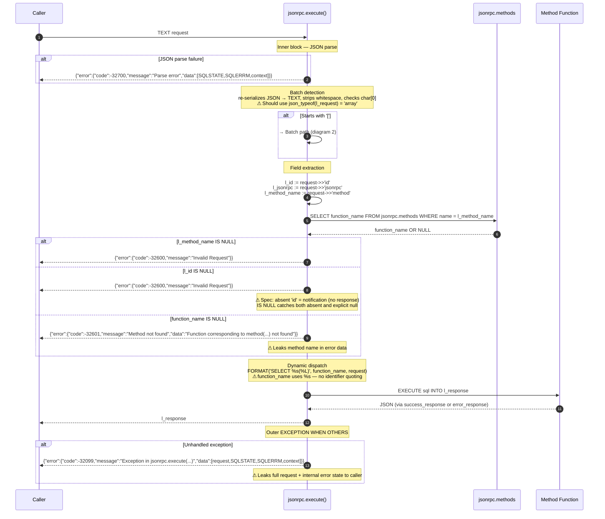
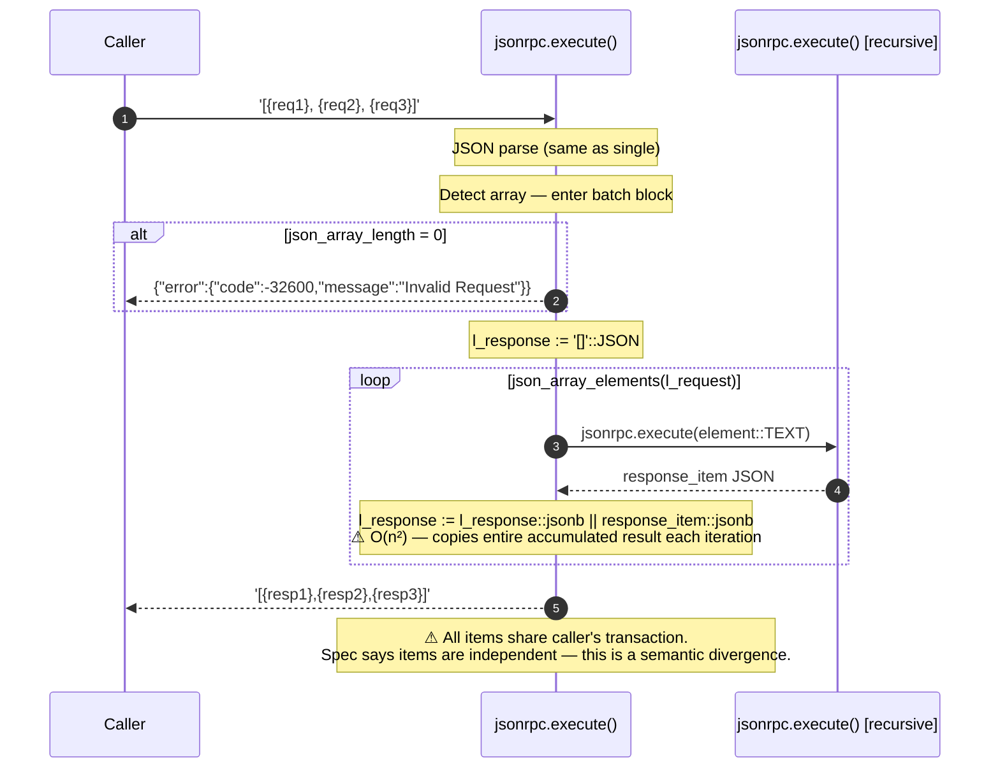
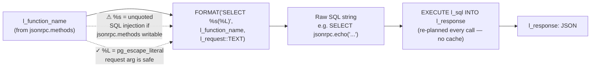
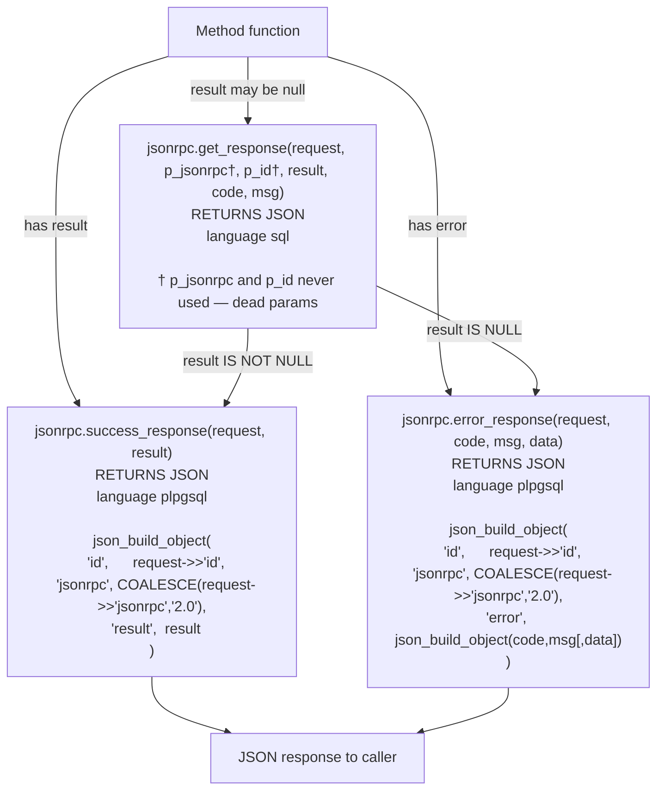
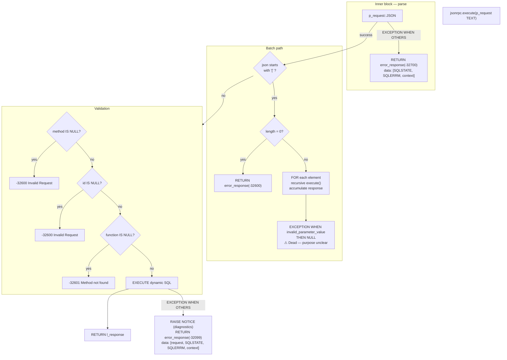

# Execution Flow — Deep Audit

> Complete lifecycle trace with Mermaid diagrams.  
> See `docs/execution-flow.md` for the concise reference version.

---

## 1. Single Request Lifecycle



---

## 2. Batch Request Lifecycle



---

## 3. Dynamic Dispatch Internals



**No plan caching.** Every call to `EXECUTE` inside PL/pgSQL re-plans the dynamic SQL. For simple echo-style methods, planning overhead can exceed execution time at high call rates. `pg_stat_statements` will show the EXECUTE as a generic statement with limited per-method visibility.

**Identifier quoting gap.** `function_name` is stored in `jsonrpc.methods` as a qualified name (e.g., `jsonrpc.echo`). It should be split on `.` and each part quoted with `quote_ident`. Current `%s` is equivalent to string concatenation — any value containing `;`, `--`, or `$` can alter the generated SQL.

---

## 4. Response Construction Chain



**`id` type coercion defect:**
```
Request:   {"id": 1, ...}           -- integer
Response:  {"id": "1", ...}         -- string  ← WRONG
```
`request->>'id'` uses the text extraction operator. Fix: use `request->'id'` (JSON extraction, preserves type).

---

## 5. Error Handling Map



---

## 6. PostgreSQL Runtime Characteristics

| Characteristic | Behavior | Risk |
|---|---|---|
| Transaction context | Inherits caller's transaction | Batch items are NOT independent |
| EXCEPTION blocks | Each creates an implicit savepoint | Low overhead per call |
| SECURITY model | SECURITY INVOKER (default) | Safe — caller's privileges apply |
| Plan caching | None — EXECUTE re-plans every call | High CPU at scale |
| WAL | Dispatch itself generates no WAL | Method functions may write |
| Lock acquisition | AccessShareLock on `jsonrpc.methods` | Negligible contention |
| Connection pooler compatibility | No session state set/read | Works with all pooler modes |
| RLS | Caller's policies apply | Correct — no RLS bypass |
