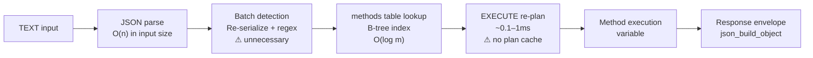
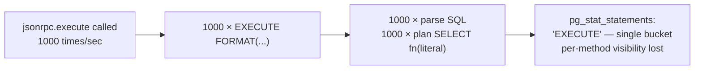
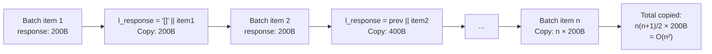
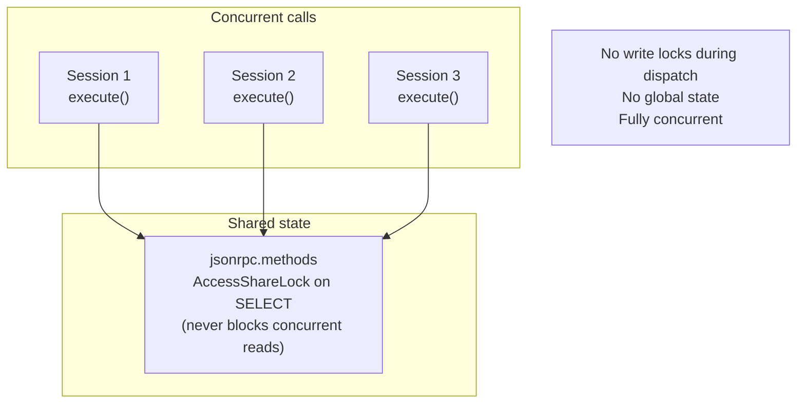
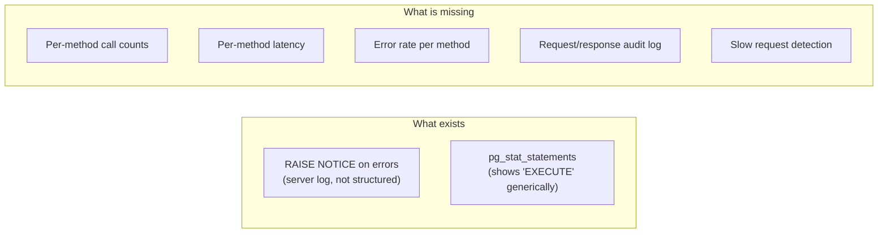

# Scalability Review — Deep Audit

> Production performance and operational analysis.  
> See `docs/scalability.md` for the concise reference version.

---

## 1. Performance Model

Every call to `jsonrpc.execute` has a fixed cost structure:



### Fixed overhead per single request (approximate)

| Step | Time | Notes |
|---|---|---|
| JSON parse | < 0.1 ms | PG native, fast |
| Batch detection | < 0.05 ms | Unnecessary re-serialize + regex |
| methods table lookup | < 0.1 ms | Single B-tree leaf read; likely buffer-cached |
| EXECUTE re-plan | 0.1–1 ms | Dominant overhead for trivial methods |
| json_build_object | < 0.05 ms | Fixed allocation |
| **Total overhead (excl. method)** | **~0.3–1.2 ms** | At 5k req/s: 15–60% of a 10ms budget |

---

## 2. Bottleneck Analysis

### Bottleneck 1 — EXECUTE Re-Planning (High Impact)



PL/pgSQL's `EXECUTE` (dynamic SQL) bypasses the plan cache. Every invocation re-plans the inner `SELECT fn(request)`. For a method that returns a constant, planning costs exceed execution costs.

**Ceiling:** At ~5,000 simple method calls/second, re-planning consumes ~500 ms of CPU/second across all backends — a meaningful fraction of available compute.

**Mitigation options:**
1. Wrap method calls in named prepared statements using `EXECUTE ... USING` — this allows PG to cache the plan within a session
2. Generate static wrapper functions at registration time that call the target directly — eliminates dynamic SQL entirely
3. Accept the overhead if call rates stay below ~2,000 req/s

---

### Bottleneck 2 — O(n²) Batch JSONB Accumulation (High Impact for Batches)



For a 100-item batch with 200B responses:
- Total bytes copied: ~1 MB (100 × 101 / 2 × 200)
- For a 1000-item batch: ~100 MB

**Ceiling:** Batches above ~50 items show measurable latency degradation from accumulation alone.

**Fix:**

```sql
-- Replace accumulation loop with array collection:
DECLARE
    l_responses JSON[] := ARRAY[]::JSON[];
...
    l_responses := array_append(l_responses, jsonrpc.execute(element::TEXT));
...
RETURN array_to_json(l_responses);
```

`array_append` is O(1) amortized; `array_to_json` serializes once at the end.

---

### Bottleneck 3 — No HTTP/Protocol Layer (Architectural)

Every caller requires a direct PostgreSQL connection. PostgreSQL's process-per-connection model has a well-known ceiling: ~200–500 connections before shared memory and context-switch overhead degrades throughput.

With no HTTP proxy layer, each concurrent JSON-RPC caller occupies one PG connection for the duration of the request.

**Ceiling:** ~200 concurrent callers without PgBouncer; ~2,000 with PgBouncer in transaction mode.

**Required:** A stateless HTTP proxy (PostgREST, custom server, or pgWire adapter) in front of PgBouncer.

---

### Bottleneck 4 — No Registry Caching (Low Impact, Addressable)

Every `jsonrpc.execute` call does:

```sql
SELECT function_name FROM jsonrpc.methods WHERE name = $1
```

In production, this table will likely fit in a single 8KB page, always buffer-cached. The index lookup adds ~0.05 ms. Not a bottleneck today, but worth noting: if the registry grows to thousands of rows or the table is modified frequently, the lookup becomes more expensive.

**Mitigation:** If registry changes become frequent, a materialized cache view or a PostgreSQL function-level cache (using `pg_background` or a connection-persistent variable) could eliminate this read.

---

## 3. Concurrency Model



**Concurrency characteristics:**
- No shared mutable state during dispatch
- `jsonrpc.methods` SELECT takes AccessShareLock — never blocks other SELECTs
- Concurrent `INSERT`/`UPDATE` on the registry blocks only with RowExclusiveLock — does not block dispatch reads
- Method functions may acquire their own locks — their contention profile is independent

**Connection pooler compatibility:**

| Mode | Compatible | Notes |
|---|---|---|
| Session mode | Yes | Full compatibility |
| Transaction mode | Yes | No session state used |
| Statement mode | Yes | Each execute() is a single statement from pooler perspective |

---

## 4. Memory Profile

| Allocation | Size | Lifetime |
|---|---|---|
| Parsed JSON (`l_request`) | Input size | Function call |
| Method name string | Tiny | Function call |
| Dynamic SQL string | ~200B | Function call |
| Response JSON | Output size | Function call |
| Batch accumulator | O(n × avg_response) → O(n²) bytes total work | Function call |

No allocations persist across calls. PostgreSQL's memory context system reclaims all per-call allocations when the function returns. There is no per-extension memory leak risk.

---

## 5. WAL and I/O Profile

| Operation | WAL generated | Notes |
|---|---|---|
| Dispatch (SELECT only path) | None | Pure read; no WAL |
| Batch accumulation | None | PL/pgSQL local variables |
| Method function writes | Yes — method's own DML | Controlled by method author |
| Registry INSERT (registration) | Yes | Infrequent admin operation |

The dispatcher itself is WAL-neutral. WAL load comes entirely from method function DML.

---

## 6. Observability Gaps



`pg_stat_statements` normalizes dynamic SQL — all dispatched calls appear under a single `EXECUTE` entry, not per method. To gain per-method observability, options are:

1. **Audit table:** Method functions write timing/error data to a `jsonrpc.audit_log` table on each call
2. **Proxy-layer logging:** The HTTP proxy records method name, latency, status before/after the PG call
3. **`auto_explain`:** Capture slow queries, but won't identify method names
4. **`pg_stat_user_functions`:** Tracks calls per function — works if each method is a separate PG function (already the case)

`pg_stat_user_functions` is the lowest-effort observability gain: it tracks calls, total time, and self time per PG function without any code changes.

---

## 7. Production Limits Summary

| Dimension | Current limit | After fixes |
|---|---|---|
| Single req/s (trivial methods) | ~5,000 (EXECUTE re-plan) | ~20,000+ (with static dispatch) |
| Batch size (no degradation) | ~20 items | ~10,000 items (with array_append fix) |
| Concurrent callers (no pooler) | ~200 | ~200 (PG process limit) |
| Concurrent callers (PgBouncer) | ~2,000 | ~2,000 |
| Registry size (no cache miss) | ~10,000 rows (fits in buffer) | same |
| Request size | Unbounded | Bounded after S6 fix |

---

## 8. Horizontal Scaling

The extension is stateless — there are no horizontal scaling blockers intrinsic to pgjsonrpc itself:

- No session state
- No shared memory outside PostgreSQL's normal buffer management
- Method registry is read-only during operation — replicates correctly to standbys
- Read-only dispatches can be routed to physical standbys

**Blocker for Xbase platform:** The absence of an HTTP layer means each horizontal scale unit requires a dedicated PostgreSQL connection budget. Solving this requires the proxy layer (see architecture.md, section 5).
