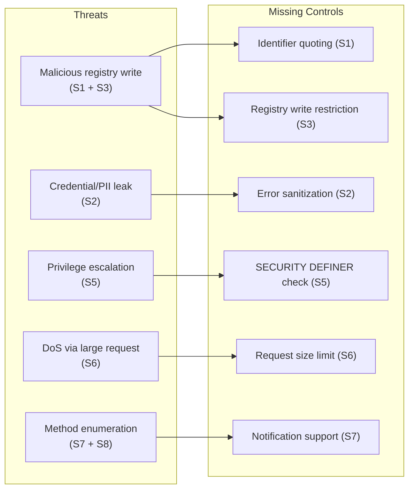

# Security Review

> Production security audit of pgjsonrpc.  
> Perspective: principal infrastructure engineer evaluating readiness for platform deployment.

---

## Summary

| # | Finding | Severity | Status |
|---|---|---|---|
| S1 | SQL injection via unquoted `function_name` | **Critical** | Open |
| S2 | Internal state leaked in error responses | **High** | Open |
| S3 | Method registry writable by any schema user | **High** | Open |
| S4 | `id` type coercion — spec violation | **High** | Open |
| S5 | No SECURITY DEFINER guard on registered functions | **Medium** | Open |
| S6 | No request size limit | **Medium** | Open |
| S7 | Notification absence mishandled — information leak | **Medium** | Open |
| S8 | Method name leaked in "not found" error data | **Low** | Open |
| S9 | `jsonrpc` field not validated — version spoofing | **Low** | Open |

---

## S1 — SQL Injection via Unquoted `function_name` (CRITICAL)

**Location:** `sql/pgjsonrpc.sql:207`

```sql
l_sql := FORMAT('SELECT %s(%L)', l_function_name, l_request);
EXECUTE l_sql INTO l_response;
```

`%s` performs no escaping or quoting. `l_function_name` comes from `jsonrpc.methods.function_name`, which is a TEXT column with no format constraints.

**Attack vector:** Any principal with `INSERT` or `UPDATE` on `jsonrpc.methods` can store an arbitrary SQL fragment as `function_name`:

```sql
-- Attacker with INSERT on jsonrpc.methods:
INSERT INTO jsonrpc.methods(name, description, function_name)
VALUES('pwn', 'x', 'pg_sleep(30); SELECT pg_read_file(''/etc/passwd'')--');

-- Resulting dispatch SQL:
SELECT pg_sleep(30); SELECT pg_read_file('/etc/passwd')--('{"..."}')
```

**Impact:**
- Arbitrary SQL execution as the calling PostgreSQL user
- Data exfiltration via side channels
- Privilege escalation if any SECURITY DEFINER functions exist in the database
- Denial of service via `pg_sleep` or expensive queries

**Remediation:**

```sql
-- Split schema.function and quote each identifier:
l_sql := FORMAT(
    'SELECT %I.%I(%L)',
    split_part(l_function_name, '.', 1),   -- schema
    split_part(l_function_name, '.', 2),   -- function
    l_request
);
```

Additionally, validate that the function exists in `pg_catalog.pg_proc` with the expected signature at registration time, not at dispatch time.

---

## S2 — Internal State Leaked in Error Responses (HIGH)

**Location:** `sql/pgjsonrpc.sql:134–139` (parse error), `sql/pgjsonrpc.sql:220–228` (outer exception)

The error `data` field in `-32700` and `-32099` responses includes:

```json
{
  "error": {
    "code": -32099,
    "data": [
      "jsonrpc.execute([{\"jsonrpc\":\"2.0\",\"method\":\"...\",\"params\":{...}}]): []",
      "SQLSTATE: [42883]",
      "SQLERRM: [function jsonrpc.mymethod(unknown) does not exist]",
      "PL/pgSQL function jsonrpc.execute(text) line 209 at EXECUTE"
    ]
  }
}
```

This exposes:
- Full original request (may contain credentials or PII if callers pass them in params)
- Internal PostgreSQL error state (`SQLSTATE`, `SQLERRM`)
- Stack trace with file/line information
- Function signatures that do not exist (aids enumeration)

**Remediation:**

Log internal error details server-side (via `RAISE LOG` or an audit table). Return a sanitized response to the caller:

```json
{"error": {"code": -32099, "message": "Internal server error"}}
```

---

## S3 — Method Registry Writable by Any Schema User (HIGH)

**Location:** `jsonrpc.methods` table — no explicit GRANT/REVOKE in `pgjsonrpc.sql`

The extension creates the `jsonrpc` schema and table but does not restrict write access. Any user with `USAGE` on the `jsonrpc` schema and default privileges can `INSERT` into `jsonrpc.methods`.

Combined with S1, this means any application-level user who can reach the database can register malicious function names.

**Remediation:**

```sql
-- After CREATE TABLE jsonrpc.methods:
REVOKE ALL ON jsonrpc.methods FROM PUBLIC;
GRANT SELECT ON jsonrpc.methods TO PUBLIC;       -- or a specific app role
GRANT INSERT, UPDATE, DELETE ON jsonrpc.methods TO jsonrpc_admin;
```

Restrict registration to a dedicated `jsonrpc_admin` role, not the application role.

---

## S4 — `id` Type Coercion Violates Spec (HIGH)

**Location:** `success_response`, `error_response`

```sql
'id', p_request->>'id'   -- text extraction: integer 1 becomes string "1"
```

The JSON-RPC 2.0 spec states: "If there was an error in detecting the id in the Request object (e.g. Parse error/Invalid Request), it MUST be Null." It further states the response `id` must match the request `id` type exactly.

**Impact:** Callers using numeric IDs (common in generated clients) will receive string IDs in responses. Strict client implementations will reject these responses as non-conforming. This is a silent interoperability defect, not just a cosmetic issue.

**Remediation:**

```sql
'id', p_request->'id'   -- JSON extraction: preserves type
```

Update all expected test output files after this change.

---

## S5 — No Guard Against SECURITY DEFINER Registered Functions (MEDIUM)

**Location:** Registration path — no validation at INSERT time

Nothing prevents a `function_name` that points to a `SECURITY DEFINER` function. When dispatched, such a function executes with the **definer's** privileges, not the caller's — bypassing the natural SECURITY INVOKER model of the dispatcher.

An attacker who can register methods (see S3) can register a SECURITY DEFINER function owned by a superuser to escalate to superuser privileges.

**Remediation:**

At registration time, validate that the target function does not use SECURITY DEFINER:

```sql
SELECT p.prosecdef
FROM pg_catalog.pg_proc p
JOIN pg_catalog.pg_namespace n ON n.oid = p.pronamespace
WHERE n.nspname = split_part(function_name, '.', 1)
  AND p.proname = split_part(function_name, '.', 2);
-- Reject if prosecdef = true
```

---

## S6 — No Request Size Limit (MEDIUM)

**Location:** `jsonrpc.execute(p_request TEXT)` — no guard on input length

A caller can send an arbitrarily large TEXT value. PostgreSQL will accept TEXT up to 1 GB. Parsing a large JSON object with `p_request::JSON` allocates memory in the backend process.

**DoS vector:** Sending a 100 MB JSON request per connection; with 100 connections, this exhausts `work_mem` budget and could cause OOM on the database server.

**Remediation:** Enforce maximum request size at the entry point:

```sql
IF octet_length(p_request) > 65536 THEN  -- or configurable
    RETURN jsonrpc.error_response(NULL, -32600, 'Request too large', NULL);
END IF;
```

Or enforce at the connection proxy layer (preferred — keeps the extension lean).

---

## S7 — Notification Mishandling Exposes Method Existence (MEDIUM)

**Location:** `sql/pgjsonrpc.sql:186–188`

JSON-RPC 2.0 notifications (requests with no `id` field) must produce **no response**. Currently:

```sql
ELSIF l_id IS NULL
THEN
    l_code := -32600;
    l_message := 'Invalid Request';
```

Callers sending a notification to a valid method receive `-32600 Invalid Request`. Callers sending a notification to an invalid method also receive `-32601 Method not found` (because method lookup runs before the id check). This asymmetry allows callers to **enumerate registered methods** without a valid `id`:

```json
// Probe request — no id:
{"jsonrpc":"2.0","method":"admin.secret_method"}

// If method exists: -32600 Invalid Request
// If method missing: -32601 Method not found
// → Attacker learns whether admin.secret_method exists
```

**Remediation:** Check for notification (`id` key absent) before method lookup. Return NULL with no response for notifications.

---

## S8 — Method Name Leaked in "Not Found" Error Data (LOW)

**Location:** `sql/pgjsonrpc.sql:194–198`

```sql
l_data := to_json(
    FORMAT('Function corresponding to method(%s) not found', l_method_name)
);
```

The caller-supplied `method` value is echoed back in the error data. While the method name came from the caller, reflecting it back confirms the exact string was received and parsed — useful for fuzzing enumeration.

**Remediation:** Return a generic error message: `"Method not found"` with no data, or omit the data field entirely.

---

## S9 — `jsonrpc` Version Field Not Validated (LOW)

**Location:** `success_response`, `error_response`

```sql
'jsonrpc', COALESCE(p_request->>'jsonrpc', '2.0')
```

The `jsonrpc` field is echoed from the request without validating it equals `"2.0"`. A request with `"jsonrpc": "1.0"` (a different protocol version) is processed and returned with `"jsonrpc": "1.0"` in the response — silently treating it as valid.

**Remediation:** Validate at the top of `execute`:

```sql
IF l_request->>'jsonrpc' != '2.0' THEN
    RETURN jsonrpc.error_response(l_request, -32600, 'Invalid Request', NULL);
END IF;
```

---

## Threat Model Summary



---

## Remediation Priority

| Priority | Finding | Effort |
|---|---|---|
| P0 — block production | S1 SQL injection | 1 hour |
| P0 — block production | S3 registry access control | 30 min |
| P1 — before external exposure | S2 error response sanitization | 2 hours |
| P1 — before external exposure | S6 request size limit | 30 min |
| P2 — spec compliance | S4 id type coercion | 1 hour + test regen |
| P2 — spec compliance | S7 notification support | 2 hours |
| P3 — hardening | S5 SECURITY DEFINER guard | 2 hours |
| P3 — hardening | S8 method name reflection | 30 min |
| P3 — hardening | S9 jsonrpc version validation | 30 min |
