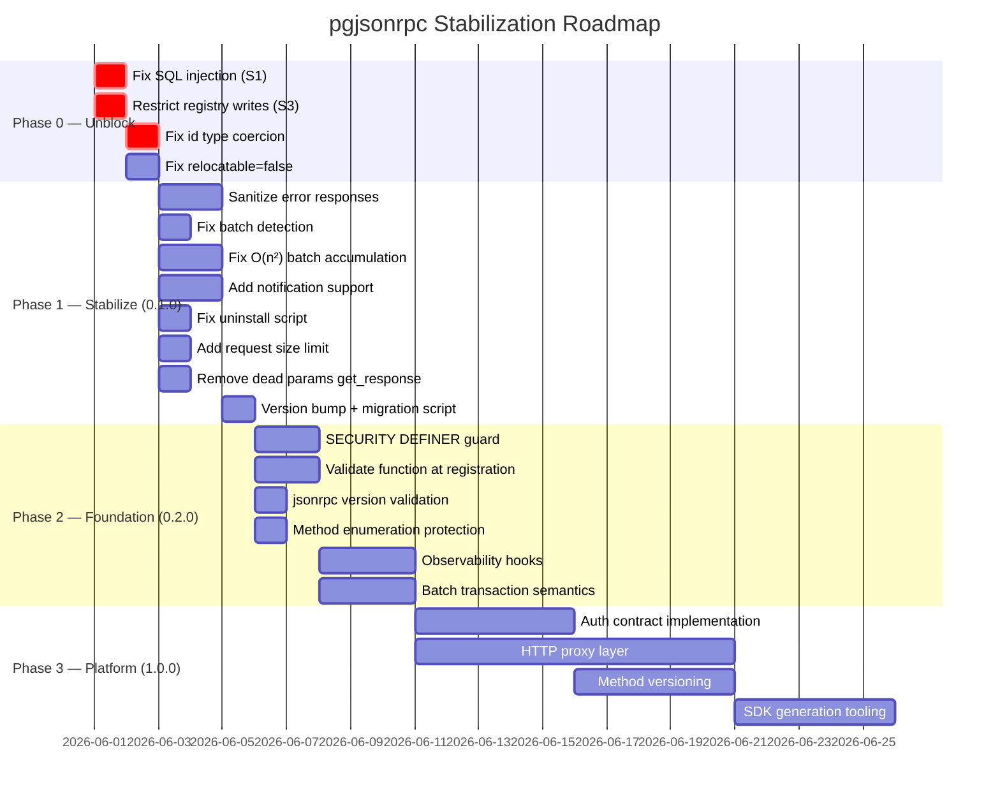

# Stabilization Roadmap — Production Readiness

> Prioritized roadmap for evolving pgjsonrpc into the long-term foundation of a platform (Xbase).  
> See `docs/stabilization-roadmap.md` for the concise initial version.  
> This document supersedes it with production-grade detail and platform context.

**Guiding principle:** Incremental stabilization, not rewrite. Fix contracts before building on top of them.

---

## Roadmap Overview



---

## Phase 0 — Unblock Production Use

These must be resolved before any production deployment or wider exposure.

---

### P0.1 — Fix SQL Injection in `function_name` Dispatch

**File:** `sql/pgjsonrpc.sql:207`  
**Severity:** Critical (see security.md S1)  
**Effort:** ~1 hour

```sql
-- BEFORE (unsafe):
l_sql := FORMAT('SELECT %s(%L)', l_function_name, l_request);

-- AFTER (safe):
l_sql := FORMAT(
    'SELECT %I.%I(%L)',
    split_part(l_function_name, '.', 1),
    split_part(l_function_name, '.', 2),
    l_request
);
```

**Test:** Add a test registering a function name with SQL metacharacters and verifying it fails safely.

---

### P0.2 — Restrict Write Access to `jsonrpc.methods`

**File:** `sql/pgjsonrpc.sql` — after `CREATE TABLE jsonrpc.methods`  
**Severity:** Critical (see security.md S3)  
**Effort:** 30 min

```sql
REVOKE ALL ON jsonrpc.methods FROM PUBLIC;
GRANT SELECT ON jsonrpc.methods TO PUBLIC;
-- Registration must be done by a privileged role (superuser or jsonrpc_admin)
```

Document the `jsonrpc_admin` role convention.

---

### P0.3 — Fix `id` Type Coercion

**File:** `sql/pgjsonrpc.sql` — `success_response`, `error_response`  
**Severity:** High — spec violation (see security.md S4)  
**Effort:** 1 hour + test output regeneration

```sql
-- BEFORE: 'id', p_request->>'id'   -- always string
-- AFTER:  'id', p_request->'id'    -- preserves type
```

All `.out` files containing `"id" : "1"` for numeric IDs must be regenerated with `make installcheck`.

---

### P0.4 — Fix `relocatable = true`

**File:** `pgjsonrpc.control`  
**Effort:** 5 min

```
relocatable = false
```

The schema name is hardcoded as `jsonrpc` throughout — the setting is silently incorrect.

---

## Phase 1 — Stabilize (Target: 0.1.0)

Core correctness, security hardening, test cleanup. Deliverable: a version that is spec-correct, safe to deploy behind a trusted boundary, and has a clean upgrade path.

---

### P1.1 — Sanitize Error Responses

**File:** `sql/pgjsonrpc.sql:134–139, 220–228`  
**Severity:** High (see security.md S2)  
**Effort:** 2 hours

Replace verbose internal error data with server-side logging:

```sql
-- Log internally:
RAISE LOG 'jsonrpc error: method=%, SQLSTATE=%, SQLERRM=%, context=%',
    l_method_name, SQLSTATE, SQLERRM, l_error_context;

-- Return sanitized response:
RETURN jsonrpc.error_response(l_request, -32099, 'Internal server error', NULL);
```

**Note:** During development, a GUC or debug flag could re-enable verbose errors.

---

### P1.2 — Replace Batch Detection Regex

**File:** `sql/pgjsonrpc.sql:144`  
**Effort:** Trivial

```sql
-- BEFORE:
IF(substring(regexp_replace(l_request::TEXT, '^\s+', ''), 1, 1) = '[')

-- AFTER:
IF json_typeof(l_request) = 'array'
```

---

### P1.3 — Fix O(n²) Batch Accumulation

**File:** `sql/pgjsonrpc.sql:159–165`  
**Effort:** 2 hours (including test verification)

```sql
-- BEFORE (O(n²)):
l_response := '[]';
LOOP
    l_response := l_response::jsonb || l_response_item::jsonb;
END LOOP;

-- AFTER (O(n)):
DECLARE
    l_responses JSON[] := ARRAY[]::JSON[];
...
LOOP
    l_responses := array_append(l_responses, jsonrpc.execute(element::TEXT));
END LOOP;
RETURN array_to_json(l_responses);
```

---

### P1.4 — Add Notification Support

**File:** `sql/pgjsonrpc.sql`  
**Effort:** 2 hours

JSON-RPC 2.0 notifications (no `id` key) must produce no response:

```sql
-- Distinguish absent 'id' from explicit null 'id':
IF NOT (l_request::jsonb ? 'id') THEN
    -- Notification: execute and return NULL
    IF l_method_name IS NOT NULL AND l_function_name IS NOT NULL THEN
        EXECUTE FORMAT('SELECT %I.%I(%L)', ...);
    END IF;
    RETURN NULL;
END IF;
```

Batch notifications (items without `id`) must be excluded from the response array.

---

### P1.5 — Fix Uninstall Script

**File:** `sql/uninstall_pgjsonrpc.sql`  
**Effort:** 30 min

Add missing functions with full signatures; document that `DROP EXTENSION pgjsonrpc CASCADE` is the correct uninstall path.

---

### P1.6 — Add Request Size Limit

**File:** `sql/pgjsonrpc.sql` — top of `execute()`  
**Effort:** 30 min

```sql
IF octet_length(p_request) > 1048576 THEN  -- 1 MB default; make configurable
    RETURN jsonrpc.error_response(NULL, -32600, 'Request too large', NULL);
END IF;
```

---

### P1.7 — Remove Dead Parameters from `get_response`

**File:** `sql/pgjsonrpc.sql:83–100`  
**Effort:** 30 min

Remove `p_jsonrpc TEXT` and `p_id TEXT`; update all call sites.

---

### P1.8 — Version Migration Script + Bump to 0.1.0

**Files:** `sql/pgjsonrpc--0.0.1--0.1.0.sql`, `pgjsonrpc.control`, `META.json`  
**Effort:** 1 hour

Create the migration script containing all DDL changes from P0–P1 as `CREATE OR REPLACE FUNCTION` and `ALTER FUNCTION` statements. Users can then run `ALTER EXTENSION pgjsonrpc UPDATE TO '0.1.0'` without losing registered methods.

---

## Phase 2 — Foundation (Target: 0.2.0)

Security hardening, observability, and correct transaction semantics. Deliverable: a version suitable for production with observable behavior and well-defined guarantees.

---

### P2.1 — SECURITY DEFINER Guard at Registration

**Effort:** 2 hours

Validate at `INSERT INTO jsonrpc.methods` (via trigger or wrapper function) that the target function does not use `SECURITY DEFINER`:

```sql
CREATE OR REPLACE FUNCTION jsonrpc.register_method(
    p_name TEXT, p_description TEXT, p_function_name TEXT
) RETURNS VOID AS $$
DECLARE
    l_is_definer BOOLEAN;
BEGIN
    SELECT p.prosecdef INTO l_is_definer
    FROM pg_catalog.pg_proc p
    JOIN pg_catalog.pg_namespace n ON n.oid = p.pronamespace
    WHERE n.nspname = split_part(p_function_name, '.', 1)
      AND p.proname = split_part(p_function_name, '.', 2);

    IF l_is_definer THEN
        RAISE EXCEPTION 'Cannot register SECURITY DEFINER function as JSON-RPC method';
    END IF;

    INSERT INTO jsonrpc.methods(name, description, function_name)
    VALUES (p_name, p_description, p_function_name);
END;
$$ LANGUAGE plpgsql SECURITY INVOKER;
```

---

### P2.2 — Validate Function Exists at Registration

**Effort:** 2 hours (combine with P2.1)

Check `pg_proc` for function existence and correct signature `(JSON) RETURNS JSON` at registration time, not at dispatch time. Return a clear error instead of a runtime `-32099` on first call.

---

### P2.3 — Validate `jsonrpc` Version Field

**Effort:** 30 min

```sql
IF l_request->>'jsonrpc' IS DISTINCT FROM '2.0' THEN
    RETURN jsonrpc.error_response(l_request, -32600, 'Invalid Request', NULL);
END IF;
```

---

### P2.4 — Method Enumeration Protection

**Effort:** 1 hour

Process notifications without revealing method existence (see security.md S7). Always return NULL for notifications, regardless of whether the method exists.

---

### P2.5 — Observability Hooks

**Effort:** 3 hours

Add an optional `jsonrpc.audit_log` table and a configurable logging function:

```sql
CREATE TABLE jsonrpc.audit_log (
    id          BIGSERIAL PRIMARY KEY,
    ts          TIMESTAMPTZ DEFAULT now(),
    method      TEXT,
    duration_ms NUMERIC,
    status      TEXT,  -- 'success' | 'error'
    error_code  INTEGER
);
```

Enable via GUC or session variable: `SET jsonrpc.audit = on`.

Additionally: document use of `pg_stat_user_functions` for zero-config per-method call counts.

---

### P2.6 — Define Batch Transaction Semantics

**Effort:** 3 hours (including documentation and tests)

Choose one of:

**Option A — Document current behavior (simplest):** All batch items share a transaction. Document this explicitly. Callers that need independent item semantics must send separate requests.

**Option B — SAVEPOINT-per-item:** Wrap each item in an explicit SAVEPOINT/RELEASE SAVEPOINT/ROLLBACK TO SAVEPOINT, giving item-level isolation within the batch:

```sql
FOR l_request_item IN SELECT * FROM json_array_elements(l_request) LOOP
    SAVEPOINT jsonrpc_batch_item;
    BEGIN
        l_response_item := jsonrpc.execute(l_request_item::TEXT);
        RELEASE SAVEPOINT jsonrpc_batch_item;
    EXCEPTION WHEN OTHERS THEN
        ROLLBACK TO SAVEPOINT jsonrpc_batch_item;
        l_response_item := jsonrpc.error_response(...);
    END;
    ...
END LOOP;
```

Option A is recommended for 0.2.0; Option B for 1.0.0.

---

## Phase 3 — Platform Foundation (Target: 1.0.0)

Xbase-readiness: auth contract, HTTP layer, method versioning, SDK generation.

---

### P3.1 — Implement Auth Contract

**Effort:** 5 days

Design and implement the `auth` field described in `doc/auth.md`:
- Token validation function (JWT or opaque token lookup)
- Session context population (`SET LOCAL jsonrpc.user_id = ...`)
- Method-level auth requirements (per-method auth flag in `jsonrpc.methods`)
- Token revocation (via `user_tokens` table)

Auth must be resolved before method dispatch, so methods can access `current_setting('jsonrpc.user_id')` without additional queries.

---

### P3.2 — HTTP Proxy Layer

**Effort:** 10 days

Deploy and configure a stateless HTTP proxy that:
- Accepts `POST /rpc` with a JSON or JSON-RPC body
- Connects to PostgreSQL via PgBouncer (transaction mode)
- Translates HTTP request → `SELECT jsonrpc.execute($1)` with body as parameter
- Returns the JSON response with appropriate HTTP status codes
- Handles authentication at the HTTP layer (JWT validation before PG connection)
- Enforces request size limits
- Provides structured access logs

Candidates: PostgREST (with RPC endpoint), a thin Node.js/Go server, or a pgWire proxy.

---

### P3.3 — Method Versioning

**Effort:** 5 days

Add a `version` column to `jsonrpc.methods` and support `method@version` dispatch syntax:

```sql
ALTER TABLE jsonrpc.methods ADD COLUMN version TEXT NOT NULL DEFAULT '1';
```

Dispatch routes `method@2` to the appropriate function. Default (no version) routes to the highest registered version.

---

### P3.4 — SDK Generation Tooling

**Effort:** 5 days

An external tool (not inside PostgreSQL) that introspects `jsonrpc.methods` and `pg_catalog.pg_proc` to generate:
- TypeScript client with typed method calls
- OpenRPC specification document
- Request/response JSON schemas (from PG type information)

---

## Contracts to Freeze Before Phase 1

These must not change after 0.1.0 ships without a major version bump and migration:

| Contract | Freeze condition |
|---|---|
| `execute(TEXT) RETURNS JSON` signature | Now |
| Method function signature `fn(JSON) RETURNS JSON` | Now |
| Error codes `-32700`, `-32600`, `-32601`, `-32099` | Now |
| `jsonrpc.methods(name, function_name)` columns | Now |
| `id` type preservation (after P0.3 fix) | After P0.3 |
| Notification semantics (after P1.4) | After P1.4 |

---

## What NOT to Rewrite

The current architecture is correct for its role. The following should evolve incrementally, not be replaced:

| Component | Why to keep |
|---|---|
| SQL-only implementation | Correct PostgreSQL extension model; no deployment complexity |
| SECURITY INVOKER dispatch | Right permission model — callers get their own grants/RLS |
| `jsonrpc.methods` registry | Simple, introspectable, replicates correctly |
| Transaction-per-call model | Correct for most use cases; document batch caveat |
| Response helper functions | Simple, correct; fix `id` coercion and they are stable |

A rewrite is not necessary. The platform gap is the **missing HTTP boundary**, not the extension internals.
